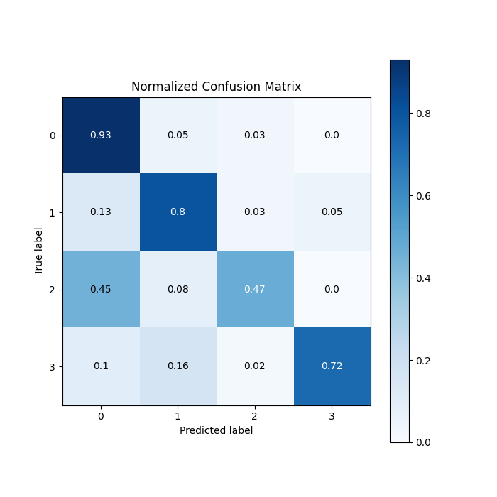

<div class="cell markdown">

# Final Project Data Analytics and IoT

## A Hybrid LSTM-Transformer Approach for Real-time Traffic, Travel and Location Prediction


</div>

<div class="cell code" >

## Abstract
This IoT design is to integrate trained machine learning models to predict the location of users and their method of transportation, in order for the IoT device to provide more accurate recommendations and suggestions as to what other apps and services they may require. The goal of this project is to prototype models that can train on data the devices will collect. To achieve such results, we will be using a LSTM time-series model for the location prediction and a Transformer classifier for the mode of transportation prediction. LSTM is a type of Recurrent Neural Network (RNN) that can handle sequential data and has the ability to retain information for long periods of time. The Transformer architecture is based on the idea of self-attention, where each input element in a sequence attends to all other input elements to compute a weighted sum.

_Keywords: LSTM, transformer, GPS data, classifier, location prediction_


</div>

<div class="cell markdown">

## Code Structure

The pipeline for training is contained in Final_notebook.ipynp

The process starts with data cleaning (.py files located in data_cleaning folder), then training the models 
(training_models folder), and finally data presentation for the Tableau Dashboard
(data_presentation).

## Data Exploration

This code reads GPS data from a randomly chosen .plt file in a specified
directory, converts the latitude and longitude coordinates into Point
objects, and creates a geopandas DataFrame to represent the data. The
resulting DataFrame is then plotted on a map using the plot() method of
the geopandas DataFrame.

</div>

<div class="output display_data">


</div>

<div class="cell markdown">

## Data Preparation

Create a pandas dataframe with every data point that has a label. This
helper function code reads multiple GPS trajectory files from 181
folders, converts the altitude column from feet to meters, merges all
dataframes into a single dataframe, and adds a label column to the
dataframe based on the transportation mode mentioned in the
corresponding text file (if available). The label addition function
'add_labels()' creates a list of dataframes, loops over each folder,
checks if there is a text file present, and if so, it loads the text
file into a dataframe, converts the start and end time columns into
datetime format, and adds the label to the main dataframe by comparing
it with the time column of the dataframe using the 'is_between()'
function. Finally, the labeled dataframe is saved as a pickle file named
'df_labels.pkl'. (This process will take a long time due huge amount of
data being processesd)

</div>

<div class="cell code" execution_count="4">

``` python
add_labels()
```

</div>

<div class="cell markdown">

## Data Cleaning

Because of the way the data was collected, there are some discontinuous
entries. Randomly large time gaps exist, as well as adjacent points that
have different labels.

Also, we need to prepare the data for the model training.

In this step, we divide the data into sequences of 100 points. Each
sequence will have smaller time-steps between points, and will have only
one label.

We also converted the latitude and longitude into x, y, and z
coordinates for easier deep learning training, and calculated the
distance between subsequent point, for velocity information.

We save the resulting arrays for easier testing.

</div>

<div class="cell code" execution_count="5">

``` python
sequence_data, label_array = create_sequences()
with open('seq_labels.npz', 'wb') as f:
    np.savez(f, sequence_data, label_array)
```

</div>

<div class="cell markdown">

## Prepare data for training

Split data into train and test sets, scale using min-max scalar

</div>

<div class="cell code" execution_count="6">

``` python
x_train_lstm, y_train_lstm, x_test_lstm, y_test_lstm, _, _ = prepare_data('lstm')
input_shape_lstm = x_train_lstm.shape[1:]
output_shape_lstm = y_train_lstm.shape[1:][0]

x_train_transformer, \
    y_train_transformer, \
    x_test_transformer, \
    y_test_transformer, _, num_classes = prepare_data('transformer')
input_shape_transformer = x_train_transformer.shape[1:]
```

</div>

<div class="cell markdown">

## Build the time series Model use LSTM

Model Building: Create a multi-layer LSTM network using the extracted
features and normalized values as input. The output layer should have as
many nodes as the number of features you want to predict (in this case,
3).

Training: Train the model using a suitable optimizer and loss function
on the preprocessed data. Monitor the accuracy of the model on a
validation set during training.

Testing: Finally, test the model on unseen data to evaluate its
performance in predicting the GPS trajectory.

</div>

<div class="cell code" execution_count="7">

``` python
lstm_model = lstm_time_series.build_model(input_shape_lstm, output_shape_lstm)
```

</div>

<div class="cell markdown">

To train LSTM and save weights

</div>

<div class="cell code" execution_count="8">

``` python
lstm_time_series.run_model()
```

</div>

<div class="cell code" execution_count="9">

``` python
# generated from plot_model_history()
Image(filename='results/lstm_loss.png')
```

<div class="output execute_result" execution_count="9">


</div>

</div>


<div class="cell markdown">

## Transformer Model

The code defines and trains a transformer-based model for a
classification task on a given dataset. The dataset is prepared using a
function called prepare_data, and the model is defined using the
transformer_encoder and build_model functions. The transformer_encoder
function implements a multi-head attention mechanism and dense layers
for normalization, dropout, and residual connection. The build_model
function applies multiple transformer blocks to the input data using the
transformer_encoder function, followed by convolutional layers, pooling,
and dense layers to generate the output. The model is compiled with the
sparse_categorical_crossentropy loss function and the Adam optimizer
with a reduced learning rate on plateau. The model is trained for 100
epochs with a batch size of 64 and callbacks for early stopping,
checkpointing, and reducing learning rate on plateau. The trained model
is evaluated on a test dataset using the evaluate function.

</div>

<div class="cell code" execution_count="15">

``` python
# generated from plot_model_history()
Image(filename='results/transformer_loss.png')
```

<div class="output execute_result" execution_count="15">


</div>

</div>

<div class="cell code" execution_count="16" collapsed="false">

``` python
# generated from plot_model_history()
Image(filename='results/transformer_accuracy.png')
```

<div class="output execute_result" execution_count="16">


</div>

</div>

<div class="cell markdown">

Confusion matrix of transformer predictions

</div>

<div class="cell code" execution_count="17">


<div class="output display_data">



</div>

</div>

<div class="cell markdown">

## Generate Tableau File

The code prepares data and uses two machine learning models, an LSTM
model and a transformer model, using the prepared data. The trained
models are used to make predictions on a test set of data. The last
location data in each test sequence is replaced with the LSTM model's
location prediction. The predictions from the transformer model are
converted from integer class values to corresponding transportation
modes using a label dictionary. A random sequence of data from the test
set is selected, and its columns are transformed to degrees of latitude
and longitude. The transformed data is saved to a CSV file named
"tableau_data.csv". Generate Tableau CSV, ready for import into Tableau.
Dashboard available
[here](https://public.tableau.com/views/AAI530FinalProject-GPSData/Dashboard1?:language=en-US&:display_count=n&:origin=viz_share_link)

</div>

<div class="cell code" execution_count="31">

``` python
generate_tableau_csv()
```

</div>
